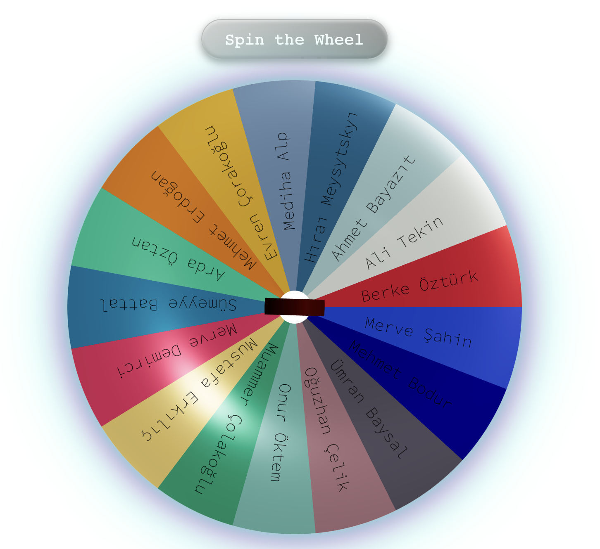

# 🎡 Classroom Wheel

A 3D spinning wheel application to randomly select students — great for classroom activities, games, or fair task distribution.

👉 [Live Demo on Vercel](https://classroom-wheel.vercel.app)

## Features

- 🎯 **Random selection** from a list of student names
- 🎨 **Colorful 3D wheel** using Three.js and React Three Fiber
- 🧭 **Smooth spinning animation**
- 🏆 **Animated popup** displaying the selected student's name
- 🔁 **No repetition** until all names have been selected

## Preview

 

## Getting Started

### 1. Install dependencies

```bash
    npm install
```

### 2. Run the development server

````
npm run dev
````
Then open http://localhost:3000 in your browser.

### Requirements
	•	Node.js v16 or higher
	•	Modern browser (with WebGL support)

### Tech Stack
	•	Next.js
	•	React
	•	Three.js
	•	React Three Fiber
	•	Framer Motion
